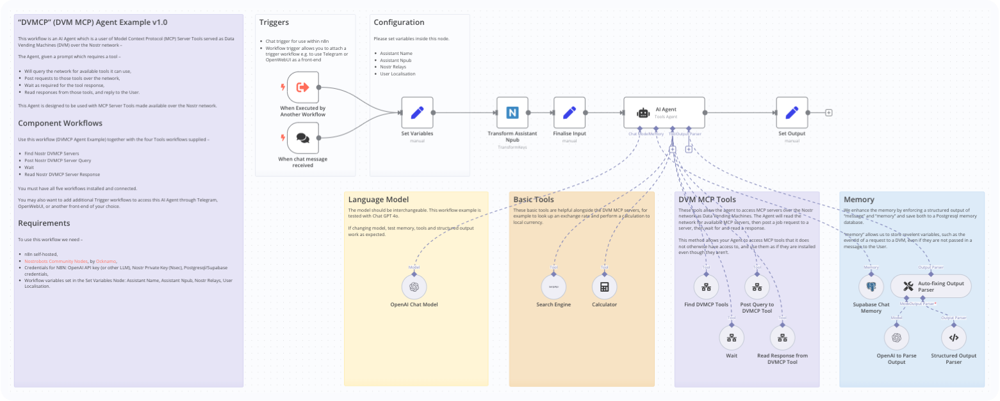

# n8n AI Agent for DVM MCP

These workflows create an AI Agent which is a user of Model Context Protocol (MCP) Server Tools served as Data Vending Machines (DVM) over the Nostr network –

The Agent, given a prompt which requires a tool –

- Will query the network for available tools it can use,
- Post requests to those tools over the network,
- Wait as required for the tool response,
- Read responses from those tools, and reply to the User.

Why this is interesting –

- For an LLM to use a MCP Tool, the MCP Server typically needs to reside upon the same system as the LLM,
- There has been no discovery methodology for an LLM to find MCP Severs and Tools which it does not yet have installed,
- Data Vending Machines allow LLMs to discover and use Tools over the Nostr network,
- This AI Agent Example demonstrates how an AI that can find and use MCP Tools that it does not have installed, by querying for them as DVMs over the Nostr network.

## Technologies

- **MCP**: The Model Context Protocol is an open protocol that allows AI agents to access data sources and tools. [Read more](https://github.com/modelcontextprotocol),
- **DVM**: Data Vending Machines listen for and respond to queries over the Nostr network. [Read more](https://github.com/nostr-protocol/nips/blob/master/90.md),
- **DVMCP**: Data Vending Machine Context Protocol bridges Model Context Protocol servers with Nostr's Data Vending Machine ecosystem. Any MCP server can serve any tool over the network, and any Agent client can access all tools served by any server. See [DVMCP by Gzuuus](https://github.com/gzuuus/dvmcp) and [NostrDVM by BelieveTheHype](https://github.com/believethehype/nostrdvm/tree/main),
- **n8n**: A low-code platform which is very convenient for creating Langchain Tools Agents. [Read more](https://docs.n8n.io/advanced-ai/).

## Prerequisites

- **n8n**: Install a self-hosted n8n on your system. You can follow the instructions from the [n8n website](https://docs.n8n.io/hosting/),
- **Nostrobots**: Install [Nostrobots Community Nodes](https://github.com/ocknamo/n8n-nodes-nostrobots/tree/main) by [Ocknamo](https://njump.me/npub1y6aja0kkc4fdvuxgqjcdv4fx0v7xv2epuqnddey2eyaxquznp9vq0tp75l) with instructions from the [n8n website](https://docs.n8n.io/integrations/community-nodes/installation/) which adds Nostr tools to your n8n isntance,
- **Add workflows from Github to n8n**: Add the five workflows to your n8n. 1. From Github copy the URL for the Raw .json ([example](https://github.com/r0d8lsh0p/n8n-AI-agent-DVM-MCP-client/raw/refs/heads/main/DVMCP_Agent_Example_v1_0.json)), 2. In n8n create a new workflow, then click "..." and "Import from URL",
- **Credentials**: Add the credentials for an OpenAI API (or other LLM), SerpAPI, Nostr Private Key (Nsec), Postgresql/Supabase,
- **Settings**: Workflow variables set in the Set Variables Node: Assistant Name, Assistant Npub, Nostr Relays, User Localisation.

If you do not have a Nostr private key, you can generate one at [NostrTool.com](https://nostrtool.com/).

### Component Workflows



The main workflow is DVMCP Agent Example v1.0.

Use this together with the four Tools Subworkflows –

- AI Tool – Find Nostr DVMCP Servers
- AI Tool – Post Nostr DVMCP Server Query
- AI Tool – Wait
- AI Tool – Read Nostr DVMCP Server Response

### Initial Setup on Install

- The DVMCP Agent must connect to its Tools Subworkflows,
- On initial install you may need to manually reconnect these. To do so, open the DVMCP Agent Example v1.0 and click each tool's node to select the correct subworkflow from the database,
- The Credentials must be entered in the DVMCP Agent Example v1.0 workflow, and also in the Post Nostr DVMCP Server Query subworkflow.

## How it Works

The Agent is prompted to use its tools in sequence to satisfy user needs. An extract from its system prompt is illustrative:

```text
**Tips for DVM Use**

- If your User requests something where you would need a tool, but do not have a tool, query for DVM MCP server tools on Nostr, and where you find a relevant tool, ask your User if you should use it.

- If your User requests to use a tool, follow these steps in sequence:

1) post your request to the MCP server
2) wait for 15 seconds
3) read the response from the MCP server
4) if there is no response from the MCP server and less than 45 seconds have passed –
Then go back to step 2 and repeat.
Else continue.
5) perform any final steps or required localisation (e.g. query forex and convert USD to local currency)
```

The system prompt and workflows can be varied to meet your use case.

## Nostr Links

- Contact me [npub1r0d8u8mnj6769500nypnm28a9hpk9qg8jr0ehe30tygr3wuhcnvs4rfsft](https://njump.me/npub1r0d8u8mnj6769500nypnm28a9hpk9qg8jr0ehe30tygr3wuhcnvs4rfsft),

## License

- This project is licensed under the MIT License.
